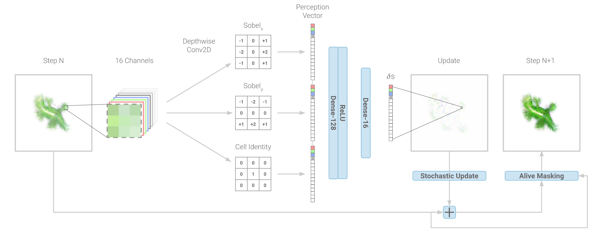
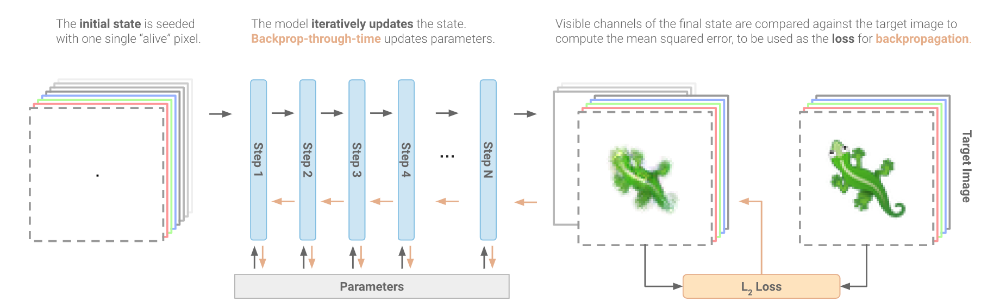
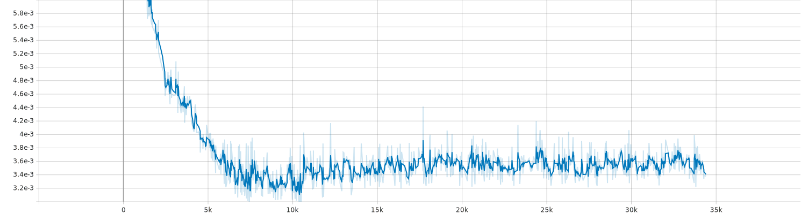

# neural-cellular-automata

Simple (partial) implementation in Pytorch of the "Growing Isotropic Neural Cellular Automata" paper by Alexander Mordvintsev and Ettore Randazzo and Craig Fouts (https://arxiv.org/abs/2205.01681)

## How does it work?

### Cell State

- RGBA + 16 hiddens states.
- The alpha value denotes if the cell is alive or not.
- The hidden state can be used (or not) by the rule generated by the neural network.

### Cellular Automaton rule

Based on this neighborhood (with convolution filters) a cell can be updated  with rule given by the Neural Network.

#### A single update step of the model

Source: https://distill.pub/2020/growing-ca/

#### Learning to grow

Source: https://distill.pub/2020/growing-ca/

## My work

Partial implementation of the paper in Pytorch:
- Neural Network Training on a image
- Destruction of the image during the training process to improve the robustness of the CA.

The goal is to generate this flower :

### Results

The model was trained on a Tesla V4 for 6.30 hours.

#### Loss evolution

#### Evolution of the generated images

#### Running the cellular automata: From one pixel set to one at the middle

#### Running the cellular automata: From random noise

#### Running the cellular automata: From horizontal line

#### Running the cellular automata: From vertical line

